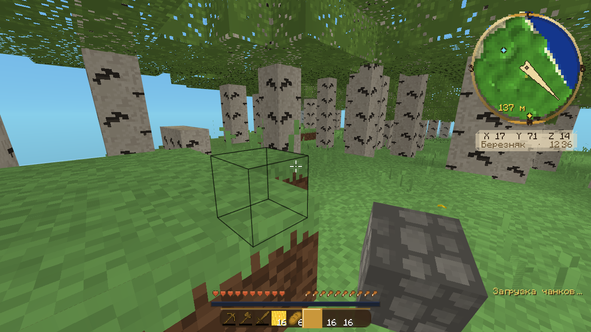
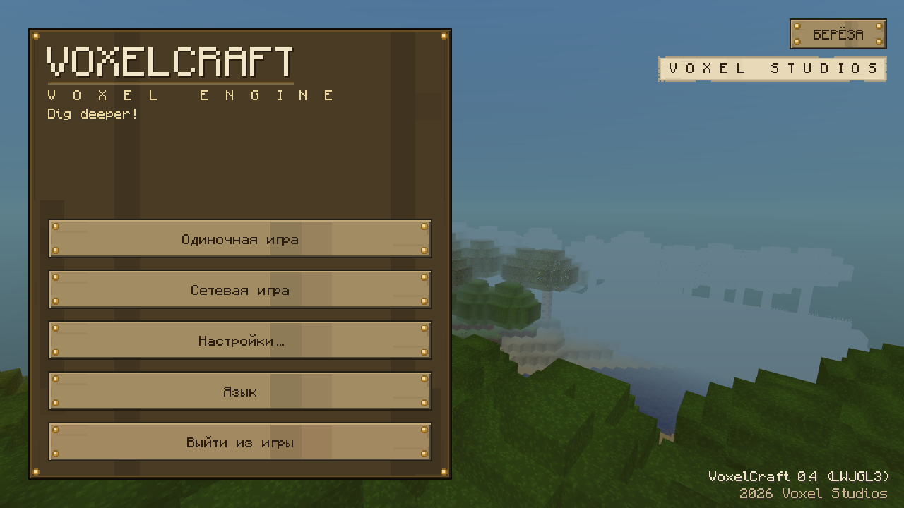
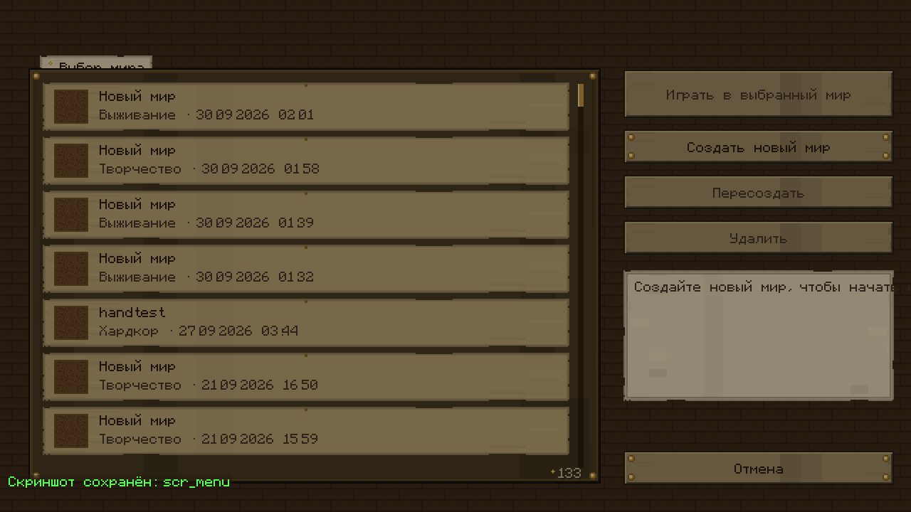
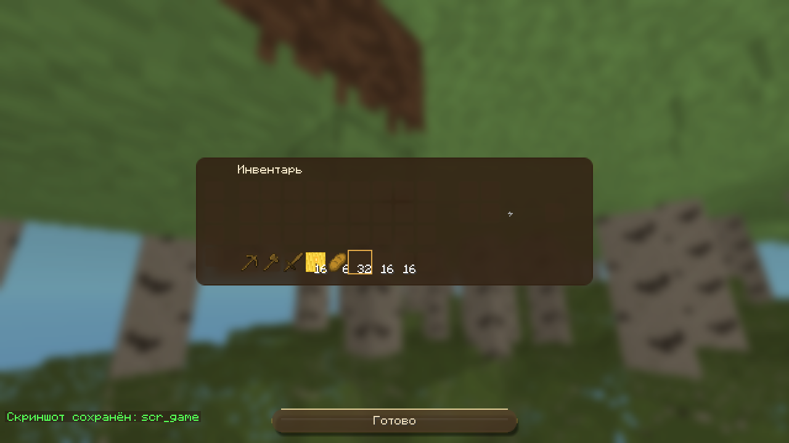

# VoxelCraft

Воксельная песочница на Java + LWJGL 3, написанная с нуля — без единого
ассета Mojang. Процедурный бесконечный мир, мобы и жители с профессиями,
торговля, зачарования, ракеты и космос, кооператив по сети — и целый
интерфейсный фреймворк «Мастерская» собственного изготовления.

<p align="center">
  
</p>

## Скриншоты

| Главное меню | Выбор мира |
|---|---|
|  |  |

| Геймплей (миникарта-компас, HUD) | Творческий инвентарь |
|---|---|
|  |  |

## Возможности

- **Бесконечный процедурный мир** — биомы (тайга, пустыня, кристальные
  пики, берёзовые рощи…), пещеры, вода с течением, погода, смена дня и ночи
- **Интерфейс «Мастерская»** — собственный UI-фреймворк `ui2`: дерево
  элементов с анимациями, клавиатурная навигация, темы «пород дерева»,
  процедурные текстуры (ни одного PNG для UI), пиксельный шрифт Monocraft
  (SIL OFL) с полным набором кириллицы
- **Миникарта-компас** — латунное кольцо, рельеф с хиллшейдингом,
  вейпоинты, стрелка-навигатор, расширенный режим по Tab
- **Жители и торговля** — профессии, репутация, сделки; животные и мобы
  (zoloy) с собственным ИИ
- **Выживание** — голод, воздух, сон, еда, зачарования, XP, достижения
- **Крафт и контейнеры** — верстак 3×3 с книгой рецептов, печь, сундуки
  (включая двойные), стол зачарований, торговля
- **Ракеты и космос** — сборка ракеты, полёт, астероиды, метеоритная руда
- **Кооператив по сети** — подключение к хосту, синхронизация игроков
- **Отладочная консоль** — файловый терминал для автоматизации проверок
  (`debug_commands.txt`): телепорт, создание миров, скриншоты, дампы атласов

## Сборка и запуск

Нужен только JDK 17+ (Windows):

```bat
build.bat          :: или powershell -ExecutionPolicy Bypass -File build.ps1
start_game.cmd
```

`build.ps1` сам скачивает зависимости (LWJGL 3.3.3, JOML) в `lib/`,
компилирует 191 исходник и копирует ресурсы. Запуск — `start_game.cmd`.

Есть headless-режим самопроверки (132 проверки логики мира, без OpenGL):

```bat
java -cp "build;lib/*" com.voxelgame.Main --headless
```

## Управление

| Клавиша | Действие |
|---|---|
| **WASD** / Space / Shift | Движение / прыжок / крадучись |
| **ЛКМ / ПКМ** | Копать / взаимодействие |
| **E** | Инвентарь |
| **1–9**, колесо | Слот хотбара |
| **Q** (+Ctrl) | Выбросить предмет |
| **T** / **/** | Чат / команда |
| **M**, **Tab**, **B** | Миникарта / большая карта / вейпоинт |
| **F3**, **F2**, **F5** | Отладка, скриншот, вид от 3-го лица |

## Структура

```
src/main/java/com/voxelgame/
  core/       игровой цикл, настройки, язык (ru/en)
  world/      генерация, биомы, свет, контейнеры, сохранения
  rendering/  атласы, шейдеры, постобработка, тени
  ui/         HUD, миникарта, иконки, стеки предметов
  ui2/        фреймворк интерфейса «Мастерская»
  player/ entity/ mob/ villager/ item/ chat/ net/ audio/ debug/
tools/        утилиты разработки (генерация текстур, превью, тесты)
```

## Лицензия

Код и процедурные ассеты — собственность автора. Шрифт
[Monocraft](https://github.com/IdreesInc/Monocraft) — SIL Open Font License
(`src/main/resources/assets/fonts/Monocraft-OFL.txt`). Ассетов Mojang в
проекте нет.
